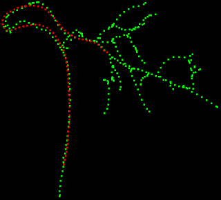

# 3D/2D vessel/catheter-based registration and 3D catheter tip tracking

This code is the implementation of the methods presented in the following papers:

1. P. Ambrosini, I. Smal, D. Ruijters, W. J. Niessen, A. Moelker and T. Van Walsum, "[A Hidden Markov Model for 3D Catheter Tip Tracking With 2D X-ray Catheterization Sequence and 3D Rotational Angiography][2017Ambrosini]," IEEE Transactions on Medical Imaging, vol. 36(3), pp. 757-768, 2017. [][2017AmbrosiniPaper]


2. P. Ambrosini, D. Ruijters, W.J. Niessen, A. Moelker and T. van Walsum, "[Continuous Roadmapping in Liver TACE Procedures Using 2D-3D Catheter-based Registration][2015Ambrosini]," International Journal of Computer Assisted Radiology and Surgery, vol. 10, pp. 1357-1370, 2015. [][2015AmbrosiniPaper]

[2017Ambrosini]: http://dx.doi.org/10.1109/TMI.2016.2625811
[2017AmbrosiniPaper]: https://drive.google.com/open?id=0B3KoSrMZcykNYjFmRzVKemlkdW8
[2015Ambrosini]: https://dx.doi.org/10.1007/s11548-015-1218-x
[2015AmbrosiniPaper]: https://drive.google.com/open?id=0B3KoSrMZcykNcGdpYlhvT2pEN0E

## Prerequisites

Tested on Windows 10 64bits with Microsoft Visual C++ 12.00 2013 update 5 express version.
It should work on Linux and with other compilers as well.

Note that the multithreading and AVX instructions are only implemented for MSVC for now.

To build the code you need:

- [CMake][cmake] to build the project
- [ITK library][itk] mainly for the Powell optimizer and ITK image routine

[cmake]: https://cmake.org/
[itk]: https://itk.org/

## Quick start

On Windows, execute these commands to build the executable. `ITK_DIR` is the path where your ITK library is.

```batch
cd cpp
mkdir generated
cd generated
cmake "../" -DCMAKE_CONFIGURATION_TYPES="Debug;Release" -DUSE_ITK=ON -DITK_DIR="C:/libs/itk"
cmake --build . --config Release
```

Then, run the example with the configuration proposed in [1] (i.e. 3D catheter tip tracking using hidden Markov model). `../../data/dataset1` is the path where the dataset is (3D vessels centerline file, initial 3D catheter tip position, 2D catheter centerline files, C-arm angle and position). `configHMMPowell.txt` is the configuration file (more information in the [Specifications section][specifications]). `generated` is the path where to save the results. `-debugImages` says that we want to have debug images to check the registrations.

[specifications]: https://github.com/pambros/HMM-3D-Catheter-Tip-Tracking#specifications

```batch
cd ../../examples/HMMPowell
mkdir generated
"../../cpp/generated/Release/TACE" Registration "../../data/dataset1" "configHMMPowell.txt" "generated" -debugImages
```

In the folder `generated` you should have now the transformation matrices and images of the registration between the 2D catheter (in red) and the 3D vessels (in green) for the sequence of 74 images.



## Specific build

In order to have your own building configuration with none default parameters, we propose a different way (actually the standard way) to build the project. First edit these two files `userSpecific/globalVariables.default.bat` and `userSpecific/buildConfig.default.bat` and change all the paths/parameters to fit your machine configuration.
Then, build the project.

```batch
cd cpp
buildConfigRedirect.bat
compileRedirect.bat
````

To see if everything went fine, check the files `cpp/generated/stderrbuildConfig.txt`, `cpp/generated/stdoutbuildConfig.txt`, `cpp/generated/stderrcompile.txt` and `cpp/generated/stdoutcompile.txt`.

Finally examples are simply launched with a batch script.

```batch
cd ../examples/HMMPowell
HMMPowellRedirect.bat
```

Output can be checked in the files `generated/stderrHMMPowell.txt` and `generated/stdoutHMMPowell.txt`.

## Examples

	WIP
	
## Specifications

	WIP
