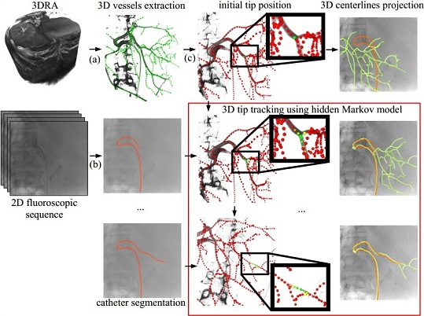

# 3D/2D vessel/catheter-based registration and 3D catheter tip tracking using hidden Markov model

This code is the implementation of the methods presented in the following papers:

1. P. Ambrosini, I. Smal, D. Ruijters, W. J. Niessen, A. Moelker and T. van Walsum: [A Hidden Markov Model for 3D Catheter Tip Tracking With 2D X-ray Catheterization Sequence and 3D Rotational Angiography][2017Ambrosini]. IEEE Transactions on Medical Imaging, vol. 36(3), pp. 757-768, 2017. [][2017AmbrosiniPaper]

2. P. Ambrosini, D. Ruijters, W.J. Niessen, A. Moelker and T. van Walsum: [Continuous Roadmapping in Liver TACE Procedures Using 2D-3D Catheter-based Registration][2015Ambrosini]. International Journal of Computer Assisted Radiology and Surgery, vol. 10, pp. 1357-1370, 2015. [][2015AmbrosiniPaper]

[2017Ambrosini]: https://dx.doi.org/10.1109/TMI.2016.2625811
[2017AmbrosiniPaper]: https://drive.google.com/open?id=0B3KoSrMZcykNYjFmRzVKemlkdW8
[2015Ambrosini]: https://dx.doi.org/10.1007/s11548-015-1218-x
[2015AmbrosiniPaper]: https://drive.google.com/open?id=0B3KoSrMZcykNcGdpYlhvT2pEN0E



## Prerequisites

Tested on:

- Windows 10 64bits with:
	- Microsoft Visual C++ 14.00 2015 update 3 express version
	- Microsoft Visual C++ 12.00 2013 update 5 express version
	- MinGW-w64 and GCC 5.4.0

It should work on Unix-like systems as well with small changes (not tested). Note that multithreading and AVX instructions are not fully supported.

To build the code you need:

- [CMake][cmake] to build the project (tested with 3.9.0-rc5)
- [ITK library][itk] mainly for the Powell optimizer and ITK image routines (tested with 4.12.0)

[cmake]: https://cmake.org/
[itk]: https://itk.org/

## Quick start

On Windows, execute these commands to build the executable. `ITK_DIR` is the path where your ITK library is.

```batch
cd cpp
mkdir generated
cd generated
cmake "../" -DCMAKE_CONFIGURATION_TYPES="Debug;Release" -DUSE_ITK=ON -DITK_DIR="C:/libs/itk"
cmake --build . --config Release
```

Then, run the example with the configuration proposed in [1] (i.e. 3D catheter tip tracking using hidden Markov model). `../../data/dataset1` is the path where the dataset is (3D vessels centerline file, initial 3D catheter tip position, 2D catheter centerline files, C-arm angle and position). `configHMMPowell.txt` is the configuration file (more information in the [Specifications section][specifications]). `generated` is the path where to save the results. `-debugImages` says that we want to have debug images to check the registrations.

[specifications]: https://github.com/pambros/HMM-3D-Catheter-Tip-Tracking#specifications

```batch
cd ../../examples/HMMPowell
mkdir generated
"../../cpp/generated/Release/TACE" Registration "../../data/dataset1" "configHMMPowell.txt" "generated" -debugImages
```

In the folder `generated` you should have now the transformation matrices and images of the registration between the 2D catheter (in red) and the 3D vessels (in green) for the sequence of 74 images.


## Specific build

In order to have your own building configuration with none default parameters, we propose a different way (actually the standard way) to build the project. First edit these two files `userSpecific/globalVariables.default.bat` and `userSpecific/buildConfig.default.bat` and change all the paths/parameters to fit your machine configuration.
Then, build the project.

```batch
cd cpp
buildConfigRedirect.bat
compileRedirect.bat
````

To see if everything went fine, check the files `cpp/generated/stderrbuildConfig.txt`, `cpp/generated/stdoutbuildConfig.txt`, `cpp/generated/stderrcompile.txt` and `cpp/generated/stdoutcompile.txt`.

Finally examples are simply launched with a batch script.

```batch
cd ../examples/HMMPowell
HMMPowellRedirect.bat
```

Output can be checked in the files `generated/stderrHMMPowell.txt` and `generated/stdoutHMMPowell.txt`.

## Examples

- `examples/HMMPowell` is the method with the optimal parameters described in [1]. You can play with the parameters in `configHMMPowell.txt`.

- `examples/HMMBruteforce` is the same as the previous example but with brute force optimizer instead of Powell optimizer. It is much slower but should be more likely to stop to the global optimum.

- `examples/shapeSimilarityBruteforce` is the method with the optimal parameters and brute force optimizer described in [2].

- `examples/shapeSimilarityPowell` is the brute force method with the optimal parameters and Powell optimizer described in [2].
	
## Specifications

### Configuration file

The configuration file in the examples has the following parameters:

- m_Method (METHOD_SHAPE_SIMILARITY = 0, METHOD_HMM = 1)
	- METHOD_SHAPE_SIMILARITY: 2D/3D registration method using shape similarity [2].
	- METHOD_HMM: 2D/3D registration method using hidden Markov model [1].

- m_Optimizer (OPTIMIZER_BRUTE_FORCE = 0, OPTIMIZER_POWELL = 1)
	- OPTIMIZER_BRUTE_FORCE: It is an exhaustive search, detail of the method is described in [2] (slow, more accurate).
	- OPTIMIZER_POWELL: It is the Powell optimizer (fast, less accurate if not initialized carefully).

- m_DistanceUsed (DISTANCE_SQR = 0, DISTANCE_ABSOLUTE = 1, DISTANCE_EUCLIDEAN = 2): Specify how is compute the minimum distance between points.
	- DISTANCE_SQR: Square distance (fast).
	- DISTANCE_ABSOLUTE: Absolute distance (fastest).
	- DISTANCE_EUCLIDEAN: Euclidean distance (slowest).

- m_MetricUsed (METRIC_FROM_CATHETER = 0, METRIC_IMPROVED_FROM_CATHETER = 1): Specify how is compute the minimum distance metric.
	- METRIC_FROM_CATHETER: Minimum distance to all points, similar to eq.4 D1(lsel, T) [2].
	- METRIC_IMPROVED_FROM_CATHETER: Minimum distance in a certain range along the path, eq.5 D(ci, lsel, T, pprev) [2].

- m_Dmax // in mm (between 10 and 150mm), use only if m_MetricUsed = METRIC_IMPROVED_FROM_CATHETER: It is the neighborhoud range for the minimum distance metric D, called dmax [2].

- m_UseWeight (True, False): Use or do not use a weight function to give more weight close to the tip in the minimum distance metric, eq.7 W(x) [2].

- m_WeightSigma // sigma (between 20 and 100 with a catheter size in average of 200mm) of the gaussian W(x) = lambda + (1.0 - lambda)*e(-x^2/(2*sigma^2)), use only if m_UseWeight = True: Sigma in the weight function W(x) [2].

- m_WeightLambda // lambda (something between 0 and 0.5), use only if m_UseWeight = True: Lambda in the weight function W(x) [2].

- m_RadiusMetric (RADIUS_METRIC_FCOST1 = 0, RADIUS_METRIC_FCOST2 = 1, RADIUS_METRIC_FCOST3 = 2): Take or do not take into account the radius in the minimum distance metric.
	- RADIUS_METRIC_FCOST1: Do not take into account the radius. Function Fcost1(c, Vi, tau) [1].
	- RADIUS_METRIC_FCOST2: Take into account the radius. Give with less penalty when a 2D point closest is in the radius of a 2D projected 3D point. Function Fcost2(c, Vi, tau) [1].
	- RADIUS_METRIC_FCOST3: Undocumented.

- m_RadiusAlpha1, use only if m_RadiusMetric = RADIUS_METRIC_FCOST2 or RADIUS_METRIC_FCOST3: Alpha1 in Fcost2(c, Vi, tau) [1].

- m_RadiusAlpha2, use only if m_RadiusMetric = RADIUS_METRIC_FCOST2 or RADIUS_METRIC_FCOST3: Alpha2 in Fcost2(c, Vi, tau) [1].

- m_NumberStateEvaluatedNo: No [1].

- m_SigmaS: sigma_s [1]

- m_TransitionMetric (TRANSITION_METRIC_GAUSSIAN_A_PRIME = 0, TRANSITION_METRIC_BINARY_A_DOUBLE_PRIME = 1)
	- TRANSITION_METRIC_GAUSSIAN_A_PRIME: a' [1]
	- TRANSITION_METRIC_BINARY_A_DOUBLE_PRIME: a'' [1]

- m_SigmaA // in mm, used only if m_TransitionMetric = TRANSITION_METRIC_GAUSSIAN_A_PRIME: sigma_a [1]

- m_Theta // in mm, used only if m_TransitionMetric = TRANSITION_METRIC_BINARY_A_DOUBLE_PRIME: theta [1]

### 3D vessel centerline structure

The structure of the 3D vessel is text file with the following lines:
- number of points
- point id of the vessel root (usually it's always 0, i.e. the first point)
- first point position, direction, radius and orthogonal direction (direction and radius are a rough estimation) separated by a ';'
(Format is "x; y; z; dir_x; dir_y; dir_z; radius; ortho_dir_x; ortho_dir_y; ortho_dir_z; 0; 0; 0; 0; 0; branch_id")
- point id neighbors of the first point separated by a ';'
- second point position, direction, radius and orthogonal direction (direction and radius are a rough estimation) separated by a ';'
- point id neighbors of the second point separated by a ';'
- ...
- last point position, direction, radius and orthogonal direction (direction and radius are a rough estimation) separated by a ';'
- point id neighbors of the last point separated by a ';'

Example: Vessel with three points. The first point is the root and is linked to the two other points.
```
3
0
5.0;4.0;4.0;0.;0.;1.;0.5;1.;1.;0.;0.;0.;0.;0.;0.;0
1;2;
5.0;4.0;5.0;0.;0.;1.;0.5;1.;1.;0.;0.;0.;0.;0.;0.;1
0;
5.0;3.0;3.0;0.;0.707;0.707;0.5;0.;0.;1.;0.;0.;0.;0.;0.;2
0;
```